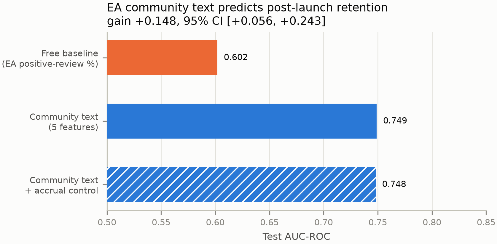
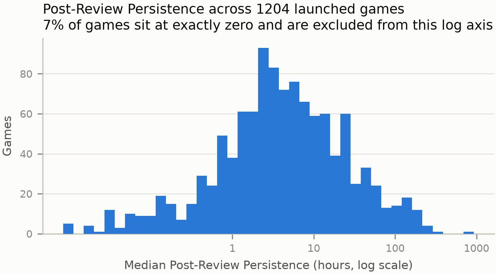
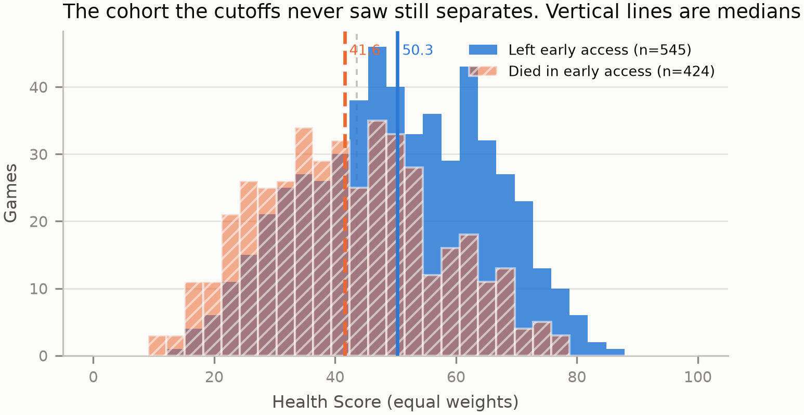
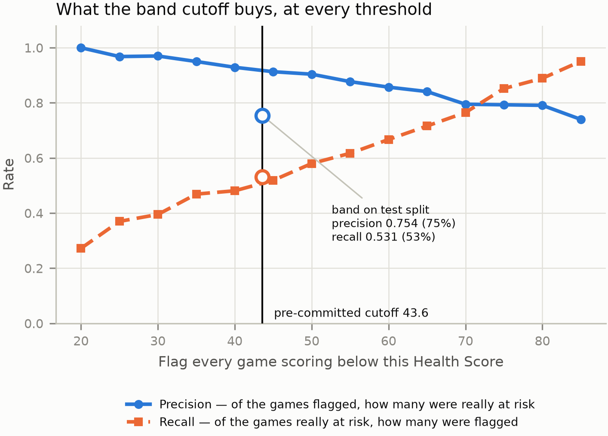
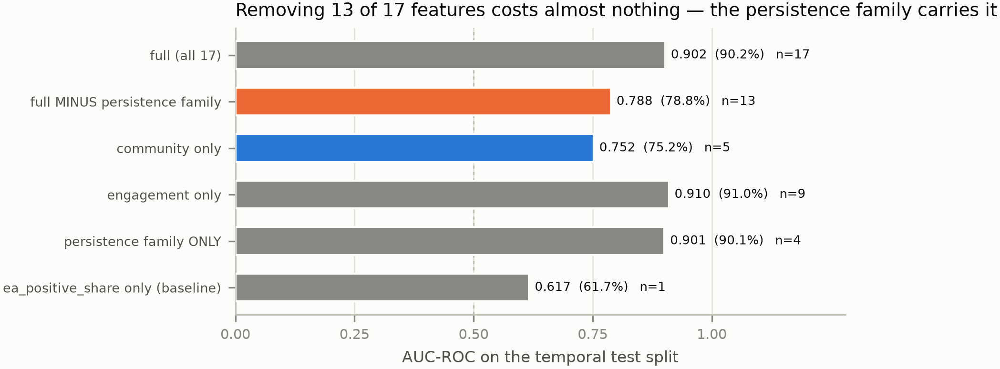
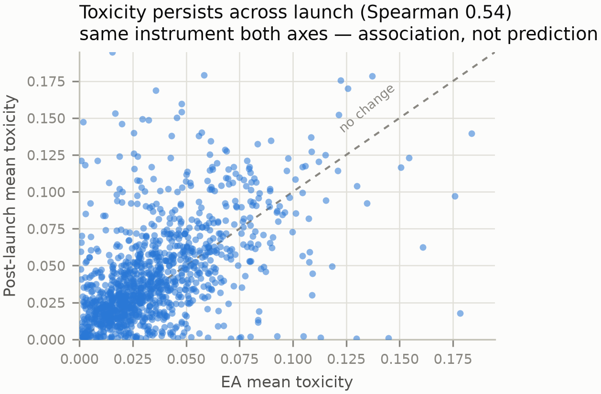
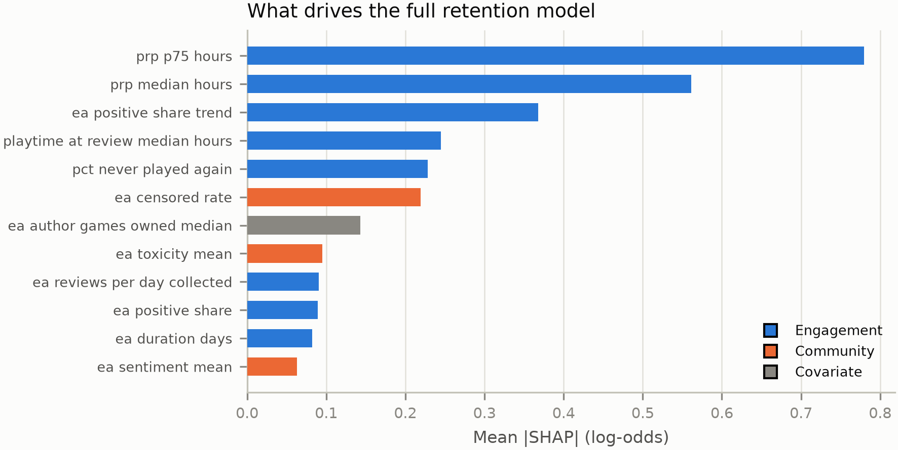

<div align="center">

# Early-Access Health Scoring

### Predicting post-launch player retention and community climate for Steam Early Access games, from nothing but the public record


**Saurabh Ganesh Mastud**

📄 **[Read the full report (PDF)](paper/EA_Health_Scoring_Report.pdf)** · 🔧 **[Configuration manual (PDF)](manual/Configuration_Manual.pdf)**

</div>

---

## The problem

A studio in Early Access reads one number to judge how it is doing: the percentage of positive
reviews on its store page.

That number measures whether players **liked** the game. It says nothing about whether they **kept
playing** it, and nothing about how the community was treating each other while they did.

So the studios least able to absorb a failed launch get the least warning that one is coming.

---

## The headline result

<div align="center">



</div>

Community climate measured from Early Access review **text** predicts post-launch retention
measured from a playtime **counter** at **0.7489 AUC**, against a store-page baseline of **0.6019**.

A gain of **+0.1482**, 95% bootstrap CI `[+0.0559, +0.2428]` over 2,000 resamples. It survives
controls for elapsed accrual time, game size, and the baseline itself — the hatched bar above is
the accrual-controlled fit, and it moves the result by 0.001.

Text goes in, a playtime counter comes out. Different instruments on each side, which is what makes
this a forecast rather than a correlation.

---

## The retention proxy

Every Steam review records the author's lifetime playtime **and** their playtime at the moment they
wrote it. The gap between the two is how much longer that player carried on after reviewing.
Aggregated across a game's reviewers, it is a behavioural retention measure that needs no operator
telemetry.

That is the point. The retention literature is built almost entirely on telemetry a six-person
studio does not have.

<div align="center">



</div>

---

## Score bands hold up on games they never saw

Band cutoffs were fitted on training games only and never shown the abandoned titles. They still
separate the **424 games that died during Early Access** from the **545 that launched**.

<div align="center">



</div>

And they translate into an operational decision. At the pre-committed cutoff of 43.6, flagging a
game as at-risk is right about three times in four, and catches just over half the games that were
genuinely at risk.

<div align="center">



</div>

---

## The part I would defend hardest: most strong results here are measurement artefacts

Steam's playtime field is a **single snapshot taken on the collection date**. So "Early Access
persistence" already contains post-launch play. It correlates with the outcome at Spearman
ρ = 0.867.

Drop thirteen of seventeen features and the model barely notices. Four persistence features alone
reproduce what the whole thing does.

<div align="center">



</div>

The 0.9008 and 0.9305 figures in this project are real numbers, they are just **associations, not
predictions**. They are reported that way everywhere they appear, with the ablation sitting next to
them.

The same trap shows up in the toxicity result: Early Access toxicity and post-launch toxicity
correlate at 0.54, but both are read off the same instrument, so it is persistence of a trait
rather than a forecast.

<div align="center">



</div>

---

## The negative result stays in

For predicting post-launch **satisfaction**, the free store-page baseline beats the full model,
**0.9144 against 0.9028**.

Early Access data predicts whether players stay. It does not beat the store page at predicting
whether they are pleased. That is in the report because it is true, not because it helps.

---

## What the model actually leans on

<div align="center">



</div>

Engagement features dominate the full retention model, which is exactly the leakage story above.
Strip them out and the community features — censored rate, mean toxicity, mean sentiment — are what
carry the honest cross-instrument forecast.

---

## Scale

| | |
|---|---|
| Catalogue screened | 21,330 titles |
| Games collected | 1,793 |
| Reviews collected | 3,504,533 |
| English reviews retained | 1,865,234 |
| Rows scored for toxicity and sentiment | 1,512,547 |
| Games in the modelling set | 545 (381 train / 164 test, split by launch date) |
| Site pages generated | 977 |

---

## Repository layout

```
paper/        the report as PDF, with its LaTeX source and bibliography
manual/       the configuration manual: step-by-step setup and reproduction, with source
notebooks/    the eight pipeline stages, config.yaml, requirements.txt
figures/      the 11 charts, PNG at 300 dpi
data/         derived game-level outputs and the 19 result tables
web/          site data builder, Astro site source, Streamlit demo
```

Pipeline order, which is not the alphabetical order the folder shows:

```
steam_catalogue → review_collection → auxiliary_sources → review_cleaning
  → toxicity_scoring → feature_engineering → health_score_model → figures
```

Each stage reads the previous stage's files off disk and writes its own. Nothing is passed in
memory, which is what makes the sequence safe to stop and restart. My own collection run died about
halfway through and cost me nothing.

Every path, threshold, band cutoff and chart colour lives in `notebooks/config.yaml`, which the
notebooks, the site builder and the demo all read. A value written anywhere else is a defect, and
that is why the report, the site and the model cannot disagree about a cutoff. The seed is fixed at
42. The band cutoffs, 43.6 and 57.2, are written back by the modelling stage from the training
data, so they are never typed by hand.

Everything fitted — scaling, weights, cutoffs — is fitted on the training partition only. The test
partition is scored once, at the end.

---

## Running it

Python **3.11.9** specifically. Most machines default to 3.13, which has no CUDA build of PyTorch,
and the toxicity stage then fails with a missing-module error that says nothing about the version.

```bash
py -3.11 -m venv .venv
.venv\Scripts\activate
pip install torch==2.11.0 --index-url https://download.pytorch.org/whl/cu128
pip install -r notebooks/requirements.txt
python -m ipykernel install --user --name ea-health-py311 --display-name "Python 3.11 (EA Health)"
```

A GPU is the only hardware that matters. Toxicity scoring on CPU alone turns minutes into hours.

The [configuration manual](manual/Configuration_Manual.pdf) is the long version of this section,
with screenshots, version numbers and a check to run after every step.

Open a notebook, check the kernel reads **Python 3.11 (EA Health)**, then Restart Kernel and Run
All Cells. Running cells individually and out of order is the one habit that produces a plausible
wrong number with no error anywhere. Every notebook ends with an assertion cell that checks its own
output.

### The two front ends

```bash
streamlit run web/app/app.py
```

```bash
python web/build_site_data.py
cd web/website && npm install && npm run build && npm run preview
```

Both read the identical JSON bundle, so the two surfaces cannot disagree about a score, a band
cutoff or a colour. Build the bundle first, or the site shows nothing.

### Experiment tracking

```bash
mlflow ui --backend-store-uri sqlite:///data/ml_runs/mlflow.db
```

Note the forward slashes. `sqlite:///` is a URI, not a Windows path, so backslashes are rejected
there even on Windows.

---

## Data, ethics and reuse

Public data only, no human participants. Review text came from Valve's unauthenticated public
storefront endpoint, rate-limited and honestly identified. Supplementary catalogue metadata is from
a CC BY 4.0 dataset (Abdelqader, 2025, DOI [10.17632/jxy85cr3th.2](https://doi.org/10.17632/jxy85cr3th.2)).

**No review text and no author identifiers are published here.** Steam's terms permit collecting
that content; they do not permit redistributing it. This repository carries derived game-level
features only. The raw corpus stays local.

Steam account identifiers are hashed at the cleaning stage. That is pseudonymisation rather than
anonymisation, and the study does not claim otherwise.

Review toxicity is a proxy for the climate of a review community. It is never a measure of any
individual's behaviour or of in-game conduct.
